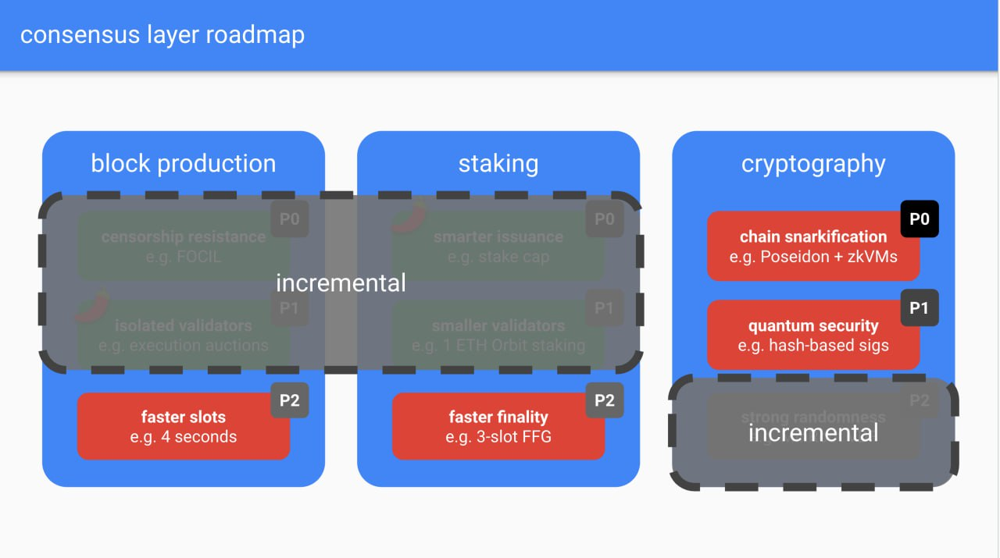

# ream-study-group

A collection of learning materials on the Beam chain and Ream client.

## Table of Content

- **Meeting notes** - See [Meeting notes](#meeting-notes) below.
- **Beacon chain** - See the [Beacon chain](./beacon-chain.md) page.
- **Beam chain** - See [Beam chain](#beam-chain) section below.
- **Development notes** - See our development notes at [ReamLabs' HackMD](https://hackmd.io/@reamlabs).

## Meeting Notes

| №   | Date                          | Notes                           | Recordings                                |
| --- | ----------------------------- | ------------------------------- | ----------------------------------------- |
| 036 | Sep 2, 2025, 14:30-15:00 UTC  | [Notes](./meeting-notes/036.md) | Not available                             |
| 035 | Aug 26, 2025, 14:30-15:00 UTC | [Notes](./meeting-notes/035.md) | Not available                             |
| 034 | Aug 19, 2025, 14:30-15:00 UTC | [Notes](./meeting-notes/034.md) | Not available                             |
| 033 | Aug 12, 2025, 14:30-15:00 UTC | [Notes](./meeting-notes/033.md) | Not available                             |
| 032 | Aug 5, 2025, 14:30-15:00 UTC  | [Notes](./meeting-notes/032.md) | Not available                             |
| 031 | Jul 29, 2025, 14:30-15:00 UTC | [Notes](./meeting-notes/031.md) | Not available                             |
| 030 | Jul 16, 2025, 14:30-15:00 UTC | [Notes](./meeting-notes/030.md) | Not available                             |
| 029 | Jul 8, 2025, 14:30-14:45 UTC  | [Notes](./meeting-notes/029.md) | Not available                             |
| 028 | Jun 23, 2025, 14:30-15:00 UTC | [Notes](./meeting-notes/028.md) | Not available                             |
| 027 | Jun 16, 2025, 14:30-15:20 UTC | [Notes](./meeting-notes/027.md) | Not available                             |
| 026 | Jun 9, 2025, 14:30-15:00 UTC  | [Notes](./meeting-notes/026.md) | Not available                             |
| 025 | Jun 2, 2025, 14:30-15:00 UTC  | [Notes](./meeting-notes/025.md) | Not available                             |
| 024 | May 26, 2025, 14:30-15:00 UTC | [Notes](./meeting-notes/024.md) | Not available                             |
| 023 | May 19, 2025, 14:30-15:00 UTC | [Notes](./meeting-notes/023.md) | Not available                             |
| 022 | May 12, 2025, 14:30-15:00 UTC | [Notes](./meeting-notes/022.md) | Not available                             |
| 021 | May 5, 2025, 14:30-15:15 UTC  | [Notes](./meeting-notes/021.md) | Not available                             |
| 020 | Apr 28, 2025, 14:30-15:00 UTC | [Notes](./meeting-notes/020.md) | Not available                             |
| 019 | Apr 21, 2025, 14:30-14:45 UTC | [Notes](./meeting-notes/019.md) | Not available                             |
| 018 | Apr 14, 2025, 14:30-15:00 UTC | [Notes](./meeting-notes/018.md) | Not available                             |
| 017 | Apr 7, 2025, 14:30-15:00 UTC  | [Notes](./meeting-notes/017.md) | Not available                             |
| 016 | Mar 31, 2025, 14:30-15:00 UTC | [Notes](./meeting-notes/016.md) | Not available                             |
| 015 | Mar 24, 2025, 14:30-15:00 UTC | [Notes](./meeting-notes/015.md) | Not available                             |
| 014 | Mar 17, 2025, 14:30-15:00 UTC | [Notes](./meeting-notes/014.md) | Not available                             |
| 013 | Mar 10, 2025, 14:30-15:00 UTC | [Notes](./meeting-notes/013.md) | Not available                             |
| 012 | Feb 24, 2025, 14:30-15:15 UTC | [Notes](./meeting-notes/012.md) | [Recording](https://youtu.be/3sBirj9rSD0) |
| 011 | Feb 17, 2025, 14:30-15:05 UTC | [Notes](./meeting-notes/011.md) | Not available                             |
| 010 | Feb 10, 2025, 14:30-15:30 UTC | [Notes](./meeting-notes/010.md) | [Recording](https://youtu.be/LK8YSviGA94) |
| 009 | Feb 3, 2025, 14:30-15:30 UTC  | [Notes](./meeting-notes/009.md) | [Recording](https://youtu.be/W_IOIjM2WBM) |
| 008 | Jan 27, 2025, 14:30-15:10 UTC | [Notes](./meeting-notes/008.md) | [Recording](https://youtu.be/BuUxOhd9VbI) |
| 007 | Jan 13, 2025, 14:30-15:10 UTC | [Notes](./meeting-notes/007.md) | [Recording](https://youtu.be/AeGFI3vWWOE) |
| 006 | Jan 6, 2025, 14:30-15:30 UTC  | [Notes](./meeting-notes/006.md) | Not available                             |
| 005 | Dec 23, 2024, 14:30-15:30 UTC | [Notes](./meeting-notes/005.md) | [Recording](https://youtu.be/JblYpv-SAJo) |
| 004 | Dec 17, 2024, 14:30-15:30 UTC | [Notes](./meeting-notes/004.md) | [Recording](https://youtu.be/JYYKFzppQrQ) |
| 003 | Dec 10, 2024, 14:30-15:30 UTC | [Notes](./meeting-notes/003.md) | [Recording](https://youtu.be/2I8SVWsfQkY) |
| 002 | Dec 2, 2024, 14:30-16:00 UTC  | [Notes](./meeting-notes/002.md) | Not available                             |
| 001 | Late November, 2024           | Not available                   | Not available                             |

## Beam chain

### Beam chain proposals

- [**Keynote: [title redacted]**](https://www.youtube.com/watch?v=lRqnFrqpq4k) - Justin Drake at Devcon SEA (Nov 2024)
- [**Ethereum Roadmap & Beamchain**](https://www.youtube.com/watch?v=8mJDt8TGebc) - Justin Drake at Bankless Summit (Nov 2024)
- [**Deep Dive into Ethereum's Beam Chain**](https://www.youtube.com/watch?v=88FDeg5JaUk) - Justin Drake with The Defiant (Nov 2024)
    - Proposing to rewrite the consensus layer instead of applying incremental upgrades
    - **Rationales**
        - Small incremental upgrades are only applicable to certain types of changes and not the others
        - Governance batching optimization: research, spec writing, EIP proposal, prioritization, testing → Batch everything to a single fork so we only go through the process once (the process will be longer per the one fork but more concentrated effort)
        - Avoid existing technical debts
    - **Comparison to The Merge**
        - *Similarity:* It’s a big change lumped together and requires a large fork
        - Difference: The Merge introduced a new set of consensus participants (from PoW miners to PoS stakers) so the two chains need to be merged. The beam chain will not change the set of consensus participants. We’ll just choose a slot number and do the change of rules at that slot number.
    - 9 items in Vitalik’s roadmap, 4-5 can be done incrementally, the rest are big ticket items that are hard to do incrementally and more suited to be done from scratch. Proposing 2 parallel R&D tracks:
        - **Beacon chain tracks** - Implement incremental changes to the Beacon Chain
            - **Block production:**
                - (1) censorship resistance (FOCIL)
                - (2) isolated validators
            - **Staking:**
                - (3) Smarter issuance
                - (4) Smaller validators
            - **Cryptography:**
                - (5) Strong randomness
        - **Beam chain tracks** - Develop the Beam Chain for the next 3-4 years and transition to it in a single hard fork
            - **Block production:** (1) Faster slots (4 seconds)
            - **Staking:** (2) Faster finality
            - **Cryptography:**
                - (3) Chain snarkification
                    - Generate a real-time, Snark proof for each and every block
                    - Required changes: hash function, signature scheme, serialization, merklelization
                - (4) Quantum security
                    - Replacing BLS signature
            - What it could enable
                - **Native Rollups** - Once the EVM is snarkified, we can expose a precompile that allows anyone to deploy an exact and as many copy of the EVM as an L2/rollup as possible, allowing horizontal scaling with customizations e.g. roll their own fee token, their own governance mechanism, their own sequencer, etc.
                    - Arbitrum and Optimism tries to be EVM-equivalent but it’s hard (keeping track of L1 changes can cause bugs, non-equivalent properties, keeping track of the L1 EVM changes). With precompiles of the L1 they can fully inherit the security of L1 and remove the governance required for upgrades.
        - To complete the roadmap in 4-5 years so **Ethereum can go into maintenance mode and start thinking about ossification like Bitcoin.**
- [**Ethereum’s Three Front War**](https://youtu.be/jUFVOUq0-fc?si=4ayhCrWKLNiv2q10&t=2936) - Bankless Podcast with Justin Drake (Dec 2024)
    - [50:17](https://youtu.be/jUFVOUq0-fc?si=skZHo978yWa1nDjP&t=3017) “The beam chain upgrade is trying to take the slowest parts of the roadmap and accelerate them so that we can complete the full Ethereum roadmap in a timely fashion.”
    - [50:55](https://youtu.be/jUFVOUq0-fc?si=PyyG8TC30Q9CjYsy&t=3055) “You can think of it as an invitation to think strategically about the Ethereum roadmap, widen the discourse and overturn window. To discuss the opportunity and necessity to do an ambitious upgrade, embrace ZK technology, reject technical debt, and optimize approach to Ethereum governance.”
    - [53:32](https://youtu.be/jUFVOUq0-fc?si=IB9w9cuGRb9wGUaA&t=3212) “One of my fears is that Ethereum ossifies prematurely not because there is a lack of good research ideas or a lack of collective desire to innovate, but because of a lack of ability to coordinate fast enough to match the ambition of the roadmap as well as the rapid growth of the ecosystem.”
    - [56:32](https://youtu.be/jUFVOUq0-fc?si=vhTB4geOZ2W0rauP&t=3392) “To a very large extent, what the consensus layer upgrades are all about is maximizing the viability of being a solo validator. 3 memes, altogether to be the renaissance of solo validating.
        - **Zen Staking** - Stakers become only responsible for attestations
        - **Fish Staking** - Reduce minimum staking amount (after increasing Max EB)
        - **Fiverr Staking** - Snarkify everything so you can validate on a smart watch
    - [1:12:13](https://youtu.be/jUFVOUq0-fc?si=5cp_8TP-tSMRrqVT&t=4333) On rollups
        - “If you consume settlement, we say that you are an L2.”
        - “If you consume DA, we say that you are a rollup.”
        - “If you consume the sequencing, we say that you’re based.”
        - “If you consume the virtual machine, we say that you are native.”
        - “If you do all these things, i.e. you are a based, native, and a rollup, then you are an ultrasound rollup, you are the maximally aligned thing possible. But it’s up to you how determined you want to be aligned with Ethereum.”
- [**Beam chain tldr**](https://youtu.be/o8n-MCAnxso?si=OQiZl3vrT9ktdzgi&t=2854) - Devcon SEA Community-Led Session: Ethereum Magicians Infinite Endgames - Ethereum Execution
    - "It's about doing a merge again / replacing the consensus layer, redesign everything with inclusion lists, make everything quantum secure, a fresh start. Get rid of Beacon Chain and replace with everything we learned from Beacon." - Guillaume
    - "Continual improvement is really a governance question and a decentralized governance problem. As an ecosystem we've gotten more conservative, need a big change, and Beam has the potential to be a significant change." - Guillaume
    - "ZK is a big part of the beam change and increased dependency on EL to have zk. The Beam change is about ZK. Also single slot and faster finality" - Alexi
    - "faster finality would be nice to have, this is a great usability change, francesco (EF) doing lots of work on this" - Guillaume
    - "This is probably my number 1 concern. There are two classes of big projects: things we know how to do but are difficult given the legacy environment and things we don't know how to do yet. Beam chain contains both of these. There are things we can change but are very difficult to do while the airplane is in the air. Need full confidence before we can ship." - lightclient
- [**Future of Ethereum: Beam Chain**](https://medium.com/@organmo/future-of-ethereum-1-beam-chain-52492e39af62) - Seungmin Jeon (Jan 2025)
  - Semi-technical elaborations on the Beam Chain objectives:
    - Shorter/Single-Slot Finality with Orbit SSF
    - Shortening block time to 4 seconds
    - Preconfirmations
    - Chain Snarkification
    - Quantum-Resistant Signatures
- [Vitalik's Twitter post on the beam chain roadmap](https://x.com/VitalikButerin/status/1885046277932552697) - Vitalik Buterin (Jan 2025)
  - By 2030, we need other things:
    - Long-term robust economics
    - Long-term robust staking decentralization
    - A clean and simple protocol, something worthy of a chain that aspires to be a neutral global base layer. This means __zeroing out huge amounts of technical bloat__
    - Security (see also: https://verified-zkevm.org , which [@alexanderlhicks](https://x.com/alexanderlhicks) has done a lot to get to its current state)
    - Fully verifying light clients that can work on even the smallest devices
    - Quantum-resistance (BTW this item is also one of the big reasons why "no AA, just keep EOAs + 7702" is NOT a valid option for ethereum long-term, we have to actually abstract the verification function as well, eg. see EIP-7701)
  - The beam chain roadmap delivers on all of these items. It is a necessary complement to all of the important short-term work that we need to get done.

### Related specifications

- [Hardware and Bandwidth Requirements for Full Nodes and Validators](https://github.com/ethereum/EIPs/pull/9270)
  - Original document for hardware requirements: https://hackmd.io/G3MvgV2_RpKxbufsZO8VVg?view
  - Original document for bandwidth requirements: https://hackmd.io/DsDcxDAVShSSLLwHWdfynQ?view

### Concerns about the Beam chain

- [**Bundling too many things, however, has problematic characteristics…**](https://x.com/peter_szilagyi/status/1856353010349400398) - Péter Szilágyi (Nov 2024)

### Discussions

- **Isn't the beam chain roadmap compatible or something existing client teams (Lighthouse, Prysm, Nimbus, etc.) naturally will adopt anyway?**
    
    > The plan is definitely for existing teams to write beam clients :)
    
- **Are you seeing new client teams tackling the beam chain in new ways and how?**
    
    > The new client teams will add diversity (e.g. jurisdictional, financial, and language diversity) as well as add fresh blood and dynamism. I'm also hoping that the beam fork is the last significant L1 upgrade and that the new client teams can help Ethereum enter maintenance mode.
    
- **Is it necessary to comply with the current consensus spec?**
    
    > Nope! Having said that, a bunch of ancillary infrastructure will be reused (e.g. libp2p, ssz, pyspec) - Justin Drake
    
- **Can we assume that Beam will use the state from a specific future block as its genesis block and proceed from there?**
    
    > Yes, you can assume that :) Existing clients may want to provide support from the beacon history.
    
- **Would it be reasonable for us to focus on building components of the Beam client that are unlikely to be affected by the spec? Does this align with your vision?**
    
    > Yes, potentially! In Q1 and Q2 I'll be working on a proof-of-concept design for the gossip and aggregation of post-quantum signatures. This may involve moving away from gossipsub and it would be good to have early p2p implementations in Q3 or Q4. I also expect some devs to start tinkering with zkVMs like RISC0 and SP1.
    >
    > A potential way to keep devs engaged in 2025 may be to have monthly study clubs where we go through key beam concepts. Another idea is to organise a beam retreat where researchers and devs spend several days together. There will probably also "beam days" around big conferences like EthCC and Devconnect.
    
- **Looking at the strawman timeline, it seems to me like all are beacon chain-worthy and only the "beam fork" is beam-specific?**
    
    > This is how I see the separation of concerns. The incremental stuff (FOCIL, execution auctions, stake capping, Orbit) is done as part of the beacon chain. The rest is pushed to the beam chain.
    > 
    > 

- **Winternitz OTS as a post-quantum signature candidate**
    > We're specifically looking at Winternitz right now. They are simple, small, efficient. And for Ethereum attestations it's OK for the signatures to be stateful because the messages being signed are indexed by the slot number. (A validator should not accidentally sign two messages with the same slot number because they would get slashed anyway.)
    >
    > Rust library: https://github.com/AtropineTears/Winternitz-OTS
